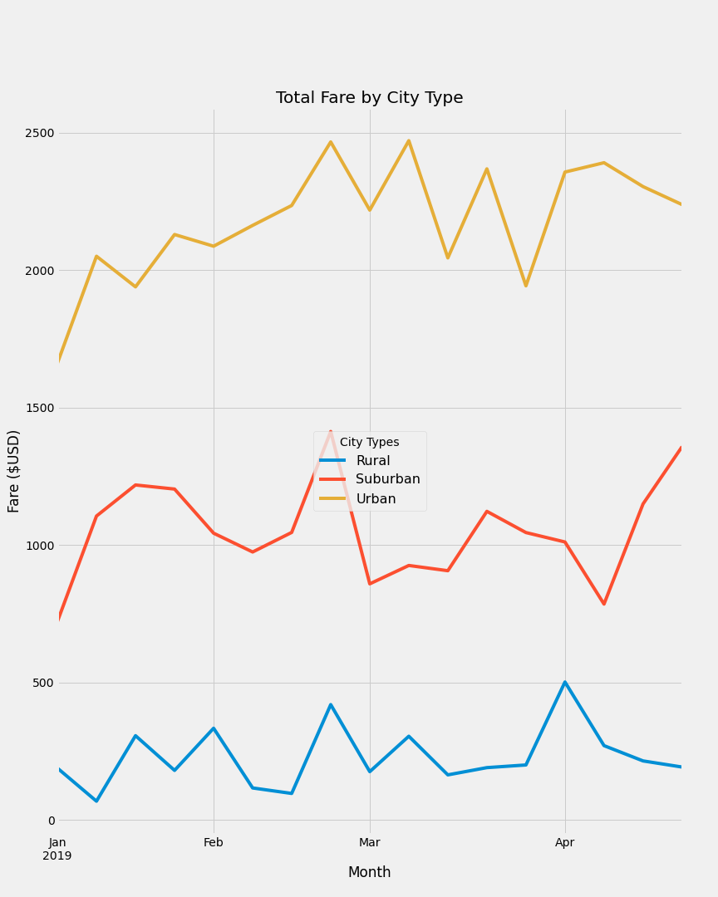

# PyBer Analysis

## Overview of Project

### Purpose

The purpose of this analysis is to compare and summarize ride-sharing data by city type (urban, suburban, rural).

## Results

### Differences in Ride-Sharing Data

- **Totals and Averages**

    If we look at the table below, we see that the total rides, total drivers, and total fares increase from rural to urban city types. For example, there are 13 times more total rides in urban areas than there are in rural areas.
    We also see a negative correlation between average fares and total rides and drivers; less drivers and rides will result in higher average fares per driver and per ride.

    

- **Weekly Fare Totals for 2019**

    The increase in total fares from rural to urban city types is illustrated in the graph below.
    We see similar peaks across all three city types near the end of February and slight dips toward the end of January.

    

## Summary

To address any disparities among city types, we recommend considering the:

1. Types of pick up/drop off locations (e.g. private residences, health care sites, grocery stores, etc.) to show what customers in each city type are using ride-sharing services for.
2. Average income of each city's population type to show if the average customer can afford the ride-sharing fares.
3. Population and DMV fee-paid vehicle registrations data. This data can give us insight to whether there is a correlation between car ownership and the data already provided in this analysis.